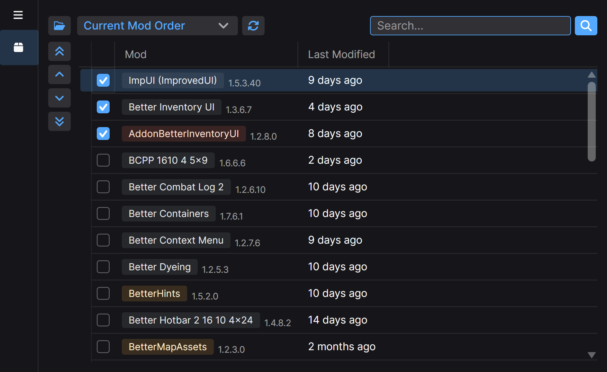

# Modthara

Cross-platform Baldur's Gate 3 mod manager and library. Manage mods without launching the game.

## Usage

> [!WARNING]
> Old patches of the game are never supported. Please update to Patch 7 or later and/or buy the game on Steam or GOG.

### App

No release yet, still heavy WIP. See https://github.com/rowlul/modthara/issues/1.

### Library

The library is available under `Modthara.Lari` namespace. At the moment, it is able to read V18 packages via
`PackageReader`
and LSX documents via `LsxReader`. `ModMetadata` and `ModSettings` can be used accordingly to parse an `LsxDocument`.
Compiles for any supported .NET platform without unmanaged dependencies.

NuGet release may be coming if it is deemed to be complete (in the scope of this mod manager).

## Credits

Many thanks to:

- [Norbyte](https://github.com/Norbyte) for the immeasurable contribution to the modding community
  and [LSLib](https://github.com/Norbyte/lslib).
- [Larian Studios](http://larian.com/) for Baldur's Gate 3, the 2023 Game of the Year.
- [Jetbrains](https://www.jetbrains.com/) for Rider and their educational license.

## License

Modthara is licensed under the MIT License. Please consult the attached LICENSE file for further details.
